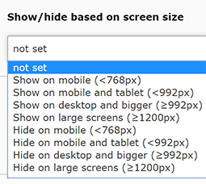

.. ==================================================
.. FOR YOUR INFORMATION
.. --------------------------------------------------
.. -*- coding: utf-8 -*- with BOM.

.. include:: ../../Includes.txt

Constants
---------
A few constants are used to define the paths and urls to assets and for main website settings.

- paths to the directories with the libraries and the website theme files

- urls (or paths if changed to local files) to bootstrap, jquery and other resources

- default language settings

The default configuration of ext:bsdist overwrites some of these settings, e.g. to load assets locally.

All constants defined by bsdist.

.. code-block:: typoscript

	plugin.tx_bsdist {
		theme {
			baseDir = fileadmin/bsdist/theme
			bootstrapCssFile = https://maxcdn.bootstrapcdn.com/bootstrap/3.3.7/css/bootstrap.min.css
			bootstrapJsFile = https://maxcdn.bootstrapcdn.com/bootstrap/3.3.7/js/bootstrap.min.js
			jQueryJsFile = https://code.jquery.com/jquery-3.2.1.min.js
			lightboxCssFile = fileadmin/bsdist/theme/css/featherlight/featherlight.css
			lightboxJsFile = fileadmin/bsdist/theme/js/lib/featherlight/featherlight.js
			contentCssFile = fileadmin/bsdist/theme/css/rte/content.css
		}
		website {
			lang {
				locale = en_EN.UTF-8
				localeShort = en
			}
		}
	}

Config object
-------------
Config object properties set by the extension.

.. code-block:: typoscript

	config {
		doctype = html5
		disablePrefixComment = 1
		removeDefaultJS = external
		inlineStyle2TempFile = 1
		absRefPrefix = /
		prefixLocalAnchors = all
		extTarget =
		noScaleUp = 1
		spamProtectEmailAddresses = ascii
		sys_language_uid = 0
		language = {$plugin.tx_bsdist.website.lang.localeShort}
		locale_all = {$plugin.tx_bsdist.website.lang.locale}
		htmlTag_langKey < config.language
		tx_realurl_enable = 1
		admPanel = 0
	}

Basic page setup
----------------
A basic page setup based on FLUIDTEMPLATE, ready for additional page templates, is defined in the extension.
The paths to the html templates match the directory structure of the bsdist extension file package which was copied to fileadmin/bsdist during the installation.

.. code-block:: typoscript

	page = PAGE
	page {
		typeNum = 0
		10 = FLUIDTEMPLATE
		10 {
			layoutRootPath = {$plugin.tx_bsdist.theme.baseDir}/tmpl/backend_layout/Layouts/
			partialRootPath = {$plugin.tx_bsdist.theme.baseDir}/tmpl/backend_layout/Partials/
			file.cObject = CASE
			file.cObject {
				key.data = levelfield:-1, backend_layout_next_level, slide
				key.override.field = backend_layout
				default = TEXT
				default.value = {$plugin.tx_bsdist.theme.baseDir}/tmpl/backend_layout/tmpl_default.html
			}
			variables {
				content < styles.content.get
			}
		}
	}

jQuery and bootstrap
--------------------
The main assets for bootstrap, jQuery and a lightbox library are set. The paths or urls are defined as constants (see above).

.. code-block:: typoscript

	page {
		#...

		includeCSS {
			bootstrap = {$plugin.tx_bsdist.theme.bootstrapCssFile}
			lightbox = {$plugin.tx_bsdist.theme.lightboxCssFile}
		}
		includeJSLibs {
			jquery = {$plugin.tx_bsdist.theme.jQueryJsFile}
		}
		includeJSFooterlibs {
			bootstrap = {$plugin.tx_bsdist.theme.bootstrapJsFile}
			lightbox = {$plugin.tx_bsdist.theme.lightboxJsFile}
		}
	}

Visibility field
----------------
An additional field is added to content elements which allows to define the visibility of the content element based on default bootstrap breakpoints.
Based on the selection additional classes are added to the outer div element to hide/show the element on certain device sizes.

Table options and rendering
---------------------------
The flexform for the table content element is replaced to support a few predefined bootstrap supported table layout options.
The rendering of tables is modified to wrap the table with 

.

Form rendering
--------------
The default rendering of forms with ext:forms now is compatible with bootstrap.

Menu options and rendering
--------------------------
The menu layout options are changed to provide bootstrap-style navigation layouts (nav pills and co.).
