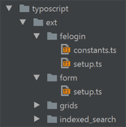

.. ==================================================
.. FOR YOUR INFORMATION
.. --------------------------------------------------
.. -*- coding: utf-8 -*- with BOM.

.. include:: ../../Includes.txt

Included extension setups
=========================

The package includes basic configurations for a few additional extensions.
See the manuals of the extensions for information about how to install and configure them before testing and using the setups provided by bsdist.
Load the configuration files of additional extension via the root files (constant.ts, setup.ts) using INCLUDE_TYPOSCRIPT.

:align: left