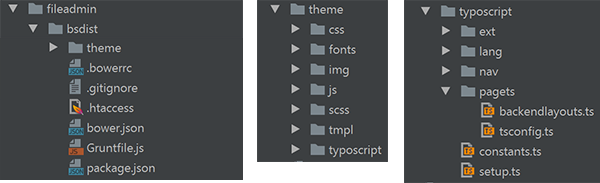
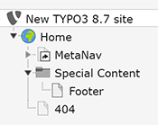
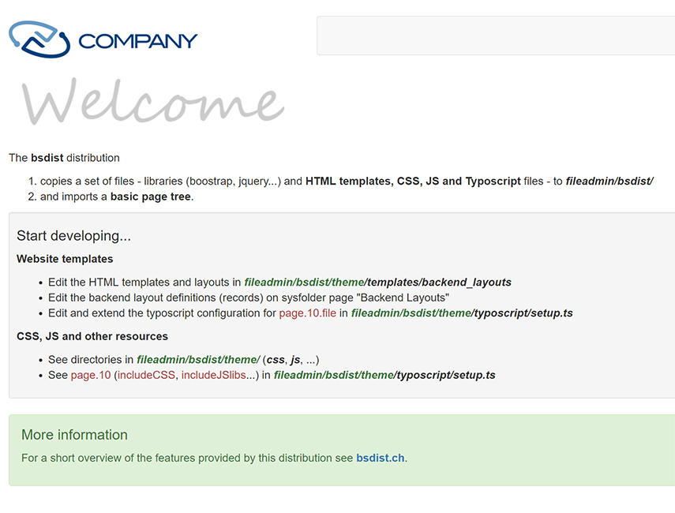

.. ==================================================
.. FOR YOUR INFORMATION
.. --------------------------------------------------
.. -*- coding: utf-8 -*- with BOM.

.. include:: ../../Includes.txt

============
Introduction
============

What does it do?
================

During the installation of the bsdist distribution

- a set of files are copied to *fileadmin/bsdist/*

- and a basic resource and page tree is imported.

Screenshots
===========
A package of files to start developing a new website.

A basic page tree is imported.

The homepage of the website after installation.

